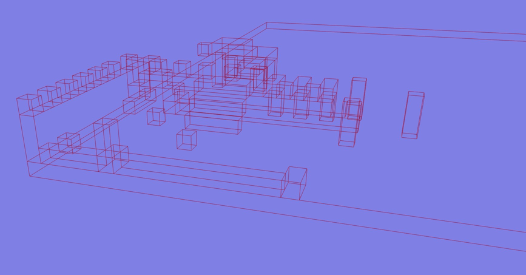

# mca-cuboids

A simple tool to merge blocks from your minecraft world to as less
amount of cuboids as possible.

## Example usage

```rust
use mca_cuboids::{BlockCoordinates, ExportParams};

let collisions = mca_cuboids::export_cuboids(
                        "dbg_lvl/region",
                        ExportParams {
                            start: BlockCoordinates::new(0, -64, 0),
                            end: BlockCoordinates::new(64, 0, 64),
                            ..Default::default()
                        },
                    ).expect("Failed to build collisions")
                    
for shape in collisions {
        let x_width = shape.end.x as f32 - shape.start.x as f32 + 1.0;
        let z_width = shape.end.z as f32 - shape.start.z as f32 + 1.0;
        let y_height = shape.end.y as f32 - shape.start.y as f32 + 1.0;

        commands
            .spawn_bundle((
                Transform::from_xyz(
                    shape.end.x as f32 - x_width / 2.0 + 0.5,
                    shape.end.y as f32 - y_height / 2.0 + 0.5,
                    shape.end.z as f32 - z_width / 2.0 + 0.5,
                ),
                GlobalTransform::identity(),
            ))
            .insert(RigidBody::Static)
            .insert(CollisionShape::Cuboid {
                half_extends: Vec3::new(x_width / 2.0, y_height / 2.0, z_width / 2.0),
                border_radius: None,
            });
    }
```

Original

Result rendered with `bevy` + `heron`(`CollisionShape::Cuboid` + `debug-3d` feature)
